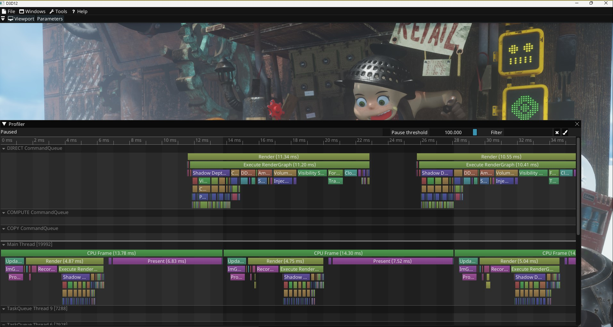

# TimelineProfiler
Simple CPU/GPU profiler with ImGui HUD
GPU profiler only supports D3D12



## Usage

### Setup

Add files to project:
- FooProfiler.cpp
- FooProfiler.h
- IconsFontAwesome4.h
- fontawesome-webfont.ttf

Add the icon font and merge it with your main font
```
ImFontConfig fontConfig;
fontConfig.MergeMode = true;
fontConfig.GlyphMinAdvanceX = 15.0f
static const ImWchar icon_ranges[] = { ICON_MIN_FA, ICON_MAX_FA, 0 };
io.Fonts->AddFontFromFileTTF(FONT_ICON_FILE_NAME_FA, 15.0f, &fontConfig, icon_ranges);
```

If you want to use the GPU profiler, initialize and shutdown as following, providing your command queues.
```
// Initialize
ID3D12CommandQueue* queues[] = {
  your_queues
};
gGPUProfiler.Initialize(d3dDevice, queues, ARRAYSIZE(queues));

// Shutdown
gGPUProfiler.Shutdown();
```

### Adding events

**Call at the start of each frame**

`PROFILE_FRAME()`

**CPU Event**

`PROFILE_CPU_SCOPE()` to add a CPU event. Optionally specify a custom name

**GPU Event**

`PROFILE_GPU_SCOPE(name, commandlist, queueIndex)` to add a GPU event.

Specify a name, the ID3D12GraphicsCommandList, and optionally the queue index this commandlist will execute on (0 by default)

**Registering a thread**

`PROFILE_REGISTER_THREAD(name)` to register a thread.

The registration order of threads will define the order in the timeline
If a thread is not registered, it will lazy-register when an event is created first.
